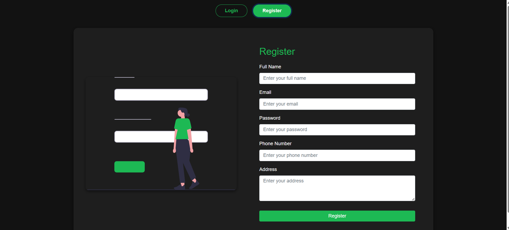
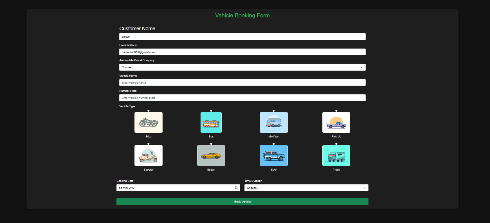
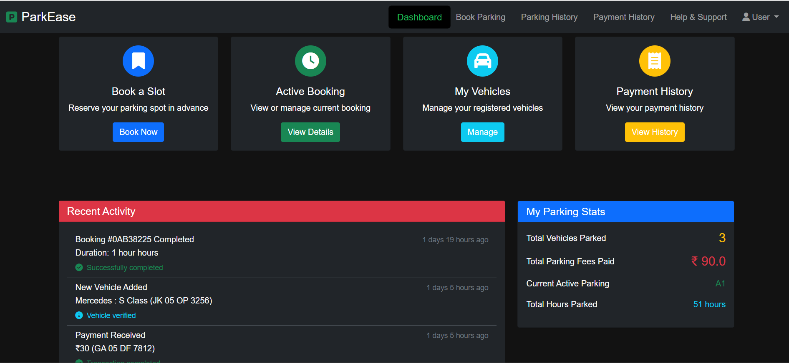
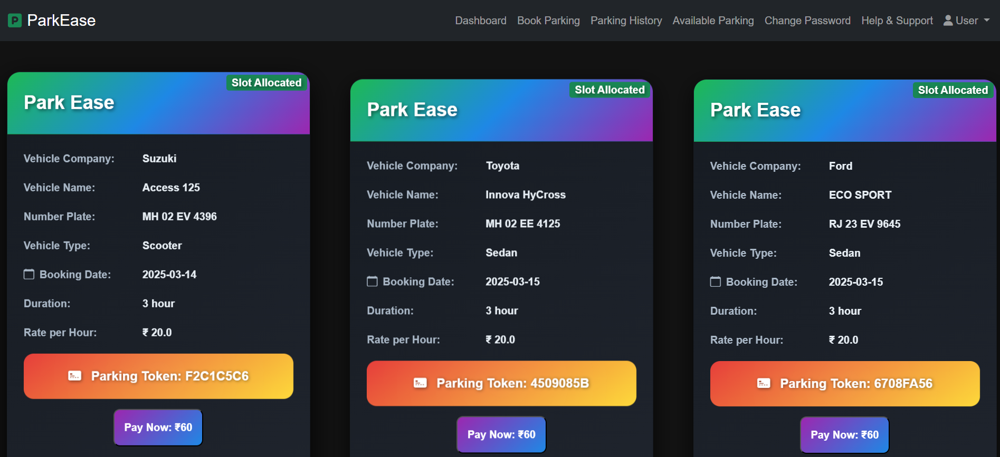
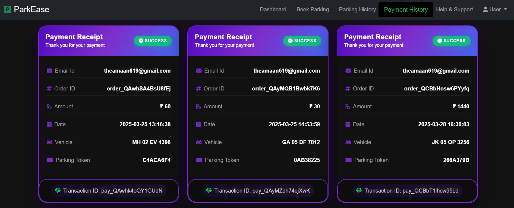
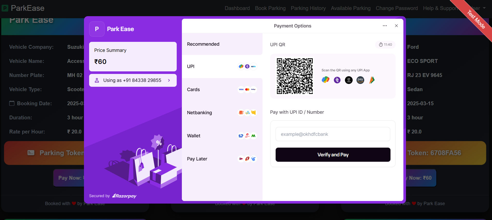

# 🚗 Car Parking Management System

A comprehensive web-based Car Parking Management System that streamlines vehicle parking operations with real-time tracking, dynamic slot allocation, booking management, and administrative control. Built using **Java (Servlets, JDBC, Hibernate)** and **MySQL**, this project aims to reduce manual efforts and bring automation to modern-day parking facilities.

## 📌 Table of Contents

- [About the Project](#about-the-project)
- [Features](#features)
- [Tech Stack](#tech-stack)
- [Screenshots](#screenshots)

---

## 📖 About the Project

This Car Parking Management System automates the entire process of vehicle parking, from booking to checkout. It includes modules for Admins, Employees (Staff), and Users, allowing for an organized flow of parking operations. The system reduces the complexity of manual parking allocation and brings in features such as real-time availability, rate per hour calculation, and payment tracking.

---

## ✨ Features

- 🔐 **Secure Login/Signup** for Admin, Staff, and Users
- 📆 **Reservation System** – Book slots in advance
- 🚦 **Live Slot Status** – View available, occupied, and upcoming reservations
- 💳 **Payment Module** – Dynamic calculation based on duration
- 📊 **Dashboard** – Real-time statistics for Admin
- 📬 **Notification System** – Alerts for reservation status
- 📁 **Modular Role-Based Access**
- 📱 **Mobile Responsive UI**

---

## 🛠 Tech Stack

- **Backend:** Java (Servlets, JDBC, Hibernate)
- **Frontend:** HTML, CSS, JavaScript, Bootstrap
- **Database:** MySQL
- **Tools:** Apache Tomcat, Maven
- **Hosting:** Render (Optional)
- **Charting:** Chart.js (for dynamic graphs like slot usage stats)

---

## 🖼 Screenshots

1. **Landing Page**  
   

2. **Admin Login**  
   

3. **Admin Panel**  
    

4. **User Registration**  
   

5. **User Login**  
   

6. **Vehicle Booking Form**  
   

7. **User Dashboard**  
   

8. **Parking History**  
   

9. **Payment History**  
   

10. **Payment Integration**  
   

